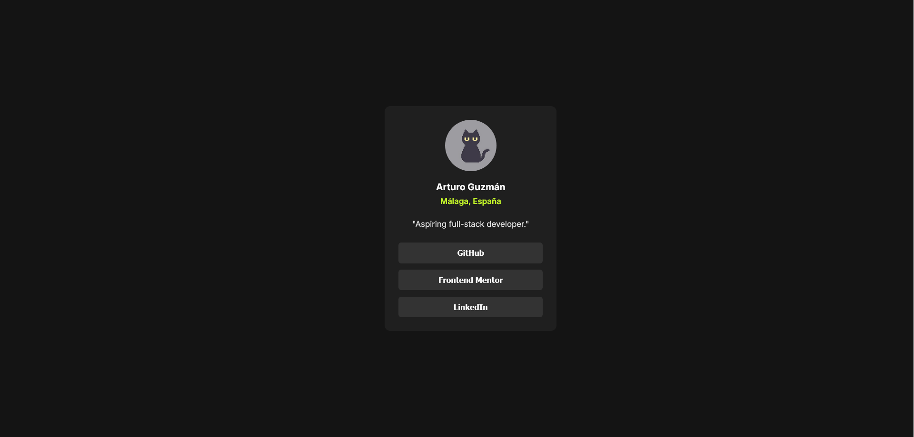

# Frontend Mentor - QR code component solution

This is a solution to the [Social link profile challenge on Frontend Mentor](https://www.frontendmentor.io/challenges/social-links-profile-UG32l9m6dQ). Frontend Mentor challenges help you improve your coding skills by building realistic projects.

## Table of contents

- [Overview](#overview)
  - [Intro](#Intro)
  - [Screenshot](#screenshot)
  - [Links](#links)
- [My process](#my-process)
  - [Built with](#built-with)
- [Author](#author)

## Overview

## Intro

Simple responsive page with a profile card showing interactive links to social media pages, part of the [Learning Paths](https://www.frontendmentor.io/learning-paths) from FrontEnd Mentor.
 
Made with Angular.

### Screenshot

### Links

- Solution URL: [netlify](https://agl-link-profile.netlify.app/)

## My process

### Built with

- Semantic HTML5 markup
- CSS custom properties
- [Angular](https://angular.dev/) - JS library

## Author

- Linkedin - [Arturo Guzmán Lucena](https://www.linkedin.com/in/agl-ab5aa228a/)
- Frontend Mentor - [@MrBlueA](https://www.frontendmentor.io/profile/MrBlueA)
